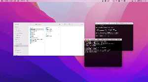

# Data Processing Web Application

Web application that processes and displays data, focusing on data type inference and conversion for datasets using React, Django, and Pandas.

[Demo video](https://youtu.be/InufhGqYQFA?si=-09KDZokp-ieE0lk)

# Usage

1. Clone Project

####

    git clone https://github.com/Kao1126/Data-Processing-Web-Application.git

2. Run frontend server

Start the termimal

####

    cd frontend
    npm install
    npm start

3. Install dependencies and run backend server

Start the other terminal

####

    cd backend
    pip3 install -r requirements.txt
    python3 manage.py runserver
